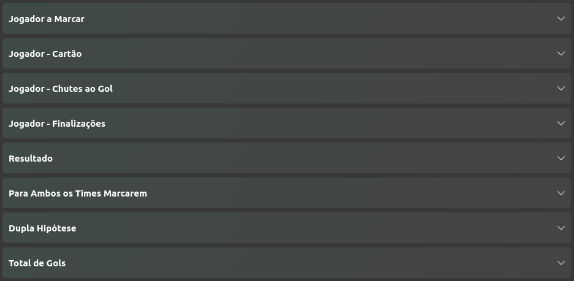
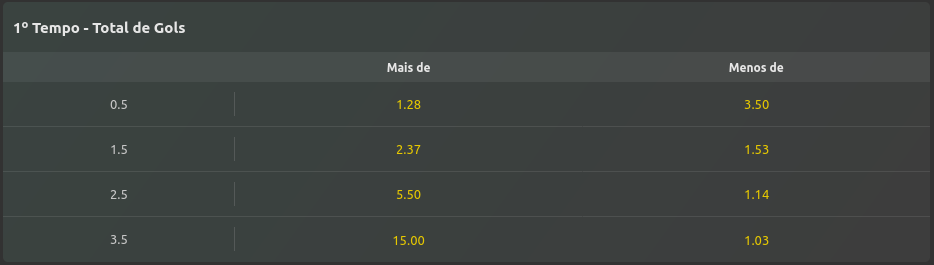
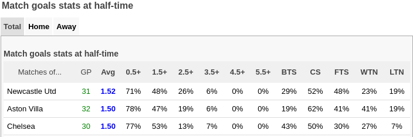
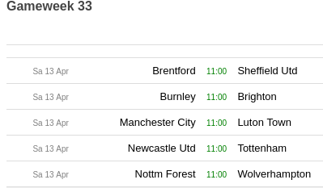

# GOALS-HT

## 📌 Visão Geral

Este projeto pessoal tem o intuito de, por meio de técnicas de web crawler e ETL, coletar tabelas do site [SoccerStats.com](https://www.soccerstats.com/), e criar uma nova tabela com estatísticas semanais de gols HT da Premier League. Foi utilizado as bibliotecas [Requests](https://requests.readthedocs.io/en/latest/) e [Beautiful Soup](https://beautiful-soup-4.readthedocs.io/en/latest/) para coleta dos dados e [Pandas](https://pandas.pydata.org/docs/#) para documentação, transformação e carregamento desses dados em .CSV e .XLSX.

## ⚽ Goals HT

Nas plataformas de apostas, temos diversos tipos de "mercados" ou categorias de apostas.

Podemos apostar no vencedor, no empate, em jogador que marcar o gol, minimo de gols, maximo de gols, escanteios e etc...

Temos infinitas possibilidades de apostas.

Um desses mercados é o de **gols no primeiro tempo (Half-Time)**. 
Onde se aposta se vai sair mais ou menos de um, dois, três gols e assim por diante.

## 📊 Análise da tabela

Antes de tudo, é importante salientar que esse é um **projeto pessoal** e não tem um intuito de ensinar algum método de aposta. Esse projeto serve apenas para meus estudos.

Iremos coletar informações da tabela de estatisticas de gols no primeiro tempo da Premier League...

 

 ...e unir com os jogos da rodada.
 
 

Para no fim criar uma média entre as duas probabilidades e ver se essa média é maior ou menor do que a do campeonato naquela fase.
 
## 🛠 Bibliotecas

### [Requests](https://requests.readthedocs.io/en/latest/)

 A biblioteca Requests do Python é uma ferramenta que simplifica a interação com a internet na linguagem Python. Permite que seus programas façam requisições HTTP para servidores e serviços online.

 ### [Beautiful Soup](https://beautiful-soup-4.readthedocs.io/en/latest/)

 A biblioteca BeautifulSoup do Python é uma ferramenta usada para processar e extrair dados de páginas HTML e XML.

 ### [Pandas](https://pandas.pydata.org/)

 A biblioteca Pandas é uma ferramenta open-source usada para análise e manipulação de dados em Python.  Ela fornece estruturas de dados eficientes para armazenar e organizar grandes volumes de informações, além de oferecer um conjunto de funcionalidades para trabalhar com esses dados de diversas maneiras.